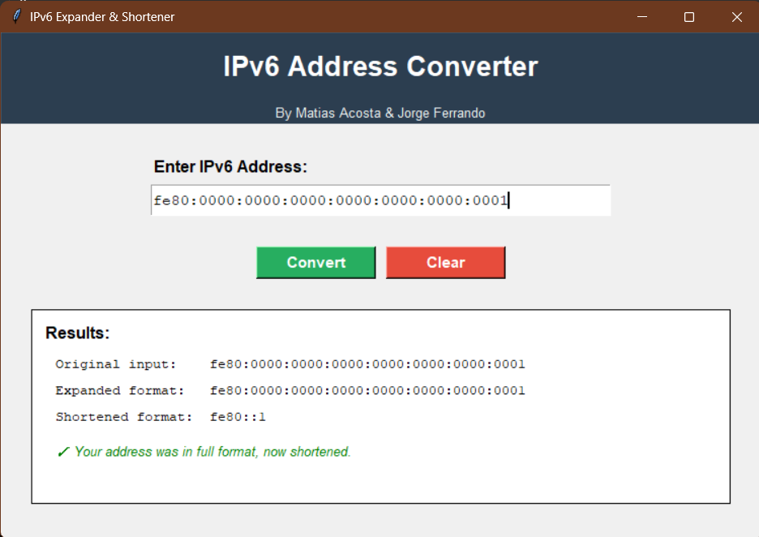

<html>
<head>
    <meta charset="UTF-8">
    <meta name="viewport" content="width=device-width, initial-scale=1.0">
    <link rel="stylesheet" href="style.css">
</head>
<body>
<h2>Expander & Shortener IPv6 Address </h2>
    <b style="color:grey"><u>First program with libraries (ipaddress):</u></b>
    
 
        This code was made by Matías & Jorge Ferrando. We aim to accomplish
        several tasks related to IPv6 addresses, such as writing the full address
        with all the zeros and having the program return the shorter IPv6 format,
        or writing the shorter IPv6 address without zeros and having the program
        return the full address with '::' to complete the shortened address. 

     <b style="color:grey"><u>Second program with windows and interfaces:</u></b>
        
 In this program, we can see that when running it, a window opens,
        displaying the same interface as the first one. <!-- However, in this case, we
        can interact with the window to perform actions related to IPv6 addresses -->
        

    <b style="color:grey"><u>Open the program:</u></b>
        
 How do you open the program? It's simple, the .py file in the github  <a href="https://github.com/mATI123765/IPv6-UTILITY-TOOL-FOR PYTHON">repository</a> can be executed
        as long as Python is installed on your computer. Once that's done, you
        can run both programs. 
        Otherwise, you can run the .exe file, and you'll be able to
        use the program without making use Python. 

    <a href="ipaddress_GUI.zip" download>Download zip folder with .exe file </a>
</body>
</html>
